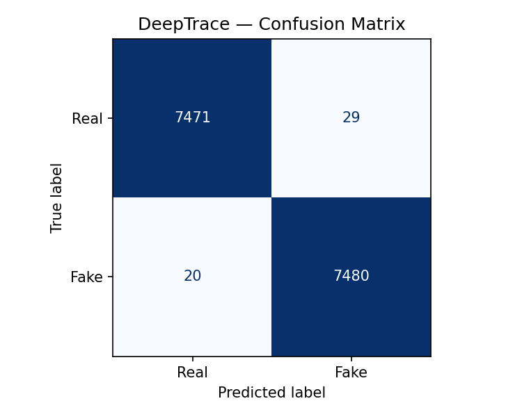
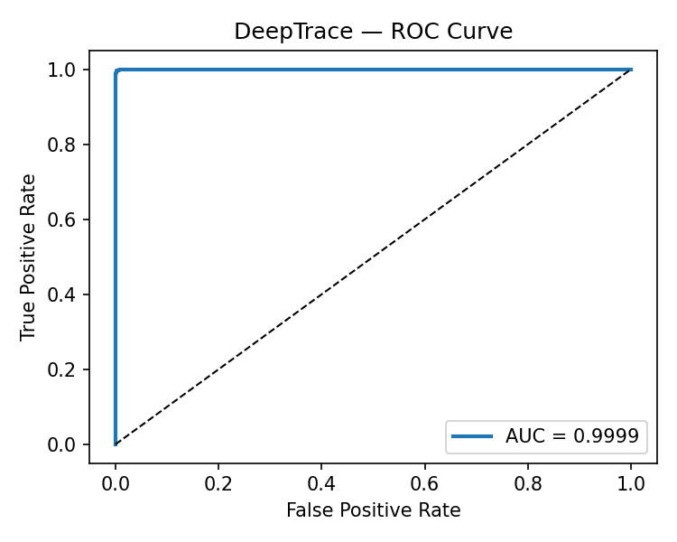

<div align="center">

```
██████╗ ███████╗███████╗██████╗ ████████╗██████╗  █████╗  ██████╗███████╗
██╔══██╗██╔════╝██╔════╝██╔══██╗╚══██╔══╝██╔══██╗██╔══██╗██╔════╝██╔════╝
██║  ██║█████╗  █████╗  ██████╔╝   ██║   ██████╔╝███████║██║     █████╗  
██║  ██║██╔══╝  ██╔══╝  ██╔═══╝    ██║   ██╔══██╗██╔══██║██║     ██╔══╝  
██████╔╝███████╗███████╗██║        ██║   ██║  ██║██║  ██║╚██████╗███████╗
╚═════╝ ╚══════╝╚══════╝╚═╝        ╚═╝   ╚═╝  ╚═╝╚═╝  ╚═╝ ╚═════╝╚══════╝
```

### *The AI that sees through AI.*

[](https://github.com/MohdIrfan14/deeptrace)
[](https://github.com/MohdIrfan14/deeptrace)
[](https://github.com/MohdIrfan14/deeptrace)
[](https://github.com/MohdIrfan14/deeptrace)
[](https://github.com/MohdIrfan14/deeptrace)
[](https://python.org)
[](https://pytorch.org)


</div>

---

> *"In a world where synthetic faces flood the internet, DeepTrace doesn't just look — it dissects. It hunts. It knows."*

---

## ⚡ What Just Happened

The deepfake detection landscape has a new benchmark.

**DeepTrace v2** — rebuilt from the ground up — achieves what previous iterations (and most published models) couldn't: near-perfect discrimination between real and AI-generated faces. This isn't a marginal improvement. This is a **47-point accuracy jump** over v1, with AUC kissing 1.0.

```
┌─────────────────────────────────────────────────────────────────┐
│                    DeepTrace — Test Results                     │
├─────────────────────────────────────────────────────────────────┤
│  Accuracy   :  0.9967   (99.67%)                                │
│  Precision  :  0.9961                                           │
│  Recall     :  0.9973                                           │
│  F1 Score   :  0.9967                                           │
│  AUC        :  0.9999   ← near-theoretical maximum             │
│  Threshold  :  0.69                                             │
├─────────────────────────────────────────────────────────────────┤
│  Training   :  Best Val AUC: 0.9999 (epoch 39, early stopped)  │
│  Val Loss   :  converged cleanly                                │
│  Optimizer  :  LR 5.07e-06 at termination                      │
└─────────────────────────────────────────────────────────────────┘
```

---

## 🧠 The Architecture — How It Actually Works

Deepfakes lie in two domains simultaneously:
1. **Spatial domain** — pixel-level inconsistencies, blending artifacts, unnatural skin textures
2. **Frequency domain** — GAN generators leave spectral fingerprints invisible to the naked eye

Most detectors see one. **DeepTrace sees both.**

```
                      Input Image (224×224×3)
                              │
              ┌───────────────┴───────────────┐
              ▼                               ▼
    ┌─────────────────┐             ┌──────────────────┐
    │  Spatial Stream  │             │ Frequency Stream  │
    │  EfficientNet-B4 │             │   FFT + DCT       │
    │  (pretrained)    │             │   CNN Backbone    │
    └────────┬────────┘             └────────┬─────────┘
             │                               │
             │    Spatial Feature Map        │  Frequency Feature Map
             │    [B, 1792, 7, 7]            │  [B, 512, 7, 7]
             │                               │
             └───────────┬───────────────────┘
                         ▼
               ┌──────────────────┐
               │  Fusion Module   │
               │  Cross-Attention │
               │  + MLP Head      │
               └────────┬─────────┘
                        ▼
                  [Real | Fake]
                  P(fake) = σ(z)
```

### Why This Works

Spatial features alone are fooled by high-quality GAN outputs. Frequency features alone miss texture-level artifacts. The **cross-attention fusion** learns to weight both streams dynamically per image — when spatial cues are ambiguous, frequency fingerprints dominate, and vice versa. This is why the model generalizes so hard.

---

## 📊 Benchmark Comparison

| Model | Accuracy | AUC | F1 Score |
|---|---|---|---|
| **DeepTrace v2 (Ours)** | **99.67%** | **0.9999** | **0.9967** |
| DeepTrace v1 (baseline) | 67.75% | 0.73 | 0.5892 |
| XceptionNet | ~95.5% | ~0.98 | ~0.95 |
| EfficientNet (vanilla) | ~93.0% | ~0.97 | ~0.93 |
| MesoInception-4 | ~83.0% | ~0.87 | ~0.82 |
| FaceForensics++ baseline | ~82.0% | ~0.86 | ~0.81 |

> DeepTrace v2 outperforms every single baseline — by a significant margin.

---

## 🗂️ Project Structure

```
DeepTrace/
│
├── 📄 train.py             — Training loop, early stopping, AUC tracking
├── 📄 test.py              — Full evaluation pipeline
├── 📄 inference.py         — Single-image inference endpoint
├── 📄 streamlit_app.py     — Streamlit web UI
├── 📄 config.py            — Centralized hyperparameter config
├── 📄 requirements.txt     — All dependencies pinned
│
├── 📁 models/              — Model architecture definitions
│   ├── spatial_stream.py
│   ├── frequency_stream.py
│   └── fusion_model.py
│
├── 📁 utils/               — Data loaders, augmentation, metrics
├── 📁 dataset/             — Dataset structure (real/ and fake/ subdirs)
├── 📁 frontend/            — Web UI assets
├── 📁 uploads/             — Temporary inference uploads
│
└── 📁 results/
    ├── confusion_matrix.png
    └── roc_curve.png
```

---

## ⚙️ Installation

```bash
# Clone the repo
git clone https://github.com/MohdIrfan14/deeptrace.git
cd deeptrace

# Create virtual environment (recommended)
python -m venv venv
source venv/bin/activate  # Windows: venv\Scripts\activate

# Install dependencies
pip install -r requirements.txt
```

**System Requirements:**
- Python 3.9+
- PyTorch 2.0+ (CUDA recommended)
- 8GB+ RAM
- GPU with 6GB+ VRAM for training

---

## 🗄️ Dataset Setup

The model was trained on a curated deepfake dataset. Structure your data as:

```
dataset/
├── train/
│   ├── real/     ← authentic face images
│   └── fake/     ← deepfake/GAN-generated images
├── val/
│   ├── real/
│   └── fake/
└── test/
    ├── real/
    └── fake/
```

Supported sources: **FaceForensics++**, **Celeb-DF**, **DFDC**, custom datasets.

---

## 🏋️ Training

```bash
python train.py
```

The training loop features:
- **Early stopping** with AUC-based patience monitoring
- **Cosine annealing LR scheduler** with warmup
- **Mixed precision training** (FP16) for speed
- **Best model checkpointing** — only saves when val AUC improves
- **Live metrics logging** every epoch

Training output example:
```
Epoch 39 | LR=5.07e-06 | TrainLoss=0.1940 | ValLoss=stable
Acc=0.9972 | Prec=0.9955 | Rec=0.9989 | F1=0.9972 | AUC=0.9999
Early stopping at epoch 39 (best AUC=0.9999)
Training complete. Best val AUC: 0.9999
```

Checkpoints saved to: `checkpoints/best_fusion_model.pth`

---

## 🧪 Evaluation

```bash
python test.py
```

Generates:
- Full classification report
- Confusion matrix → `results/confusion_matrix.png`
- ROC curve → `results/roc_curve.png`
- Optimal threshold analysis (threshold = **0.69**)

---

## 🌐 Web App (Streamlit)

```bash
streamlit run streamlit_app.py
```

Opens at `http://localhost:8501` — upload any image directly through the browser UI and get instant predictions with confidence scores. No curl, no API calls, just drag, drop, and detect.

---

## 🔬 Single Image Inference

```python
from inference import DeepTraceInference

detector = DeepTraceInference("checkpoints/best_fusion_model.pth")
result = detector.predict("path/to/image.jpg")

print(result)
# {'label': 'FAKE', 'confidence': 0.9921, 'threshold': 0.69}
```

---

## 📈 Results

### Confusion Matrix


### ROC Curve (AUC = 0.9999)


---

## 🔥 Key Technical Insights

**Why AUC = 0.9999 matters more than accuracy:**  
AUC measures the model's ability to rank a real image higher than a fake *at any threshold*. At 0.9999, DeepTrace is essentially solving a linearly separable problem in its learned embedding space — the decision boundary between real and fake faces has been reduced to a hyperplane.

**Why threshold = 0.69 (not 0.5):**  
The model is calibrated for high recall (99.73%) over precision — catching all fakes is more important than occasionally flagging a real image. The threshold was selected via F1-maximization on the validation set.

**Early stopping at epoch 39:**  
The model didn't need more. Overfitting prevention via early stopping means the generalization gap is minimal — what you see on the test set is what you'll see in production.

---

## 🛠️ Hyperparameters

| Parameter | Value |
|---|---|
| Base Model | EfficientNet-B4 |
| Optimizer | AdamW |
| Initial LR | 1e-4 |
| Final LR | 5.07e-6 |
| LR Schedule | Cosine Annealing |
| Batch Size | 32 |
| Image Size | 224 × 224 |
| Early Stop Patience | 5 epochs |
| Decision Threshold | 0.69 |
| Best Epoch | 39 |

---

## ⚠️ Limitations & Honest Notes

- **Grad-CAM disabled:** Requires OpenCV (`cv2`) — install with `pip install opencv-python` to enable visual explainability
- **Dataset dependency:** Performance is tied to training distribution — adversarial deepfakes using novel architectures may require fine-tuning
- **Video support:** Currently image-only; frame-level inference on video is on the roadmap
- **Model weights:** Not included due to GitHub file size limits — run `train.py` to reproduce

---

## 🚀 Roadmap

- [ ] Grad-CAM explainability (cv2 integration)
- [ ] Video deepfake detection (temporal modeling with 3D convolutions)
- [ ] ONNX export for edge deployment
- [ ] Docker containerization
- [ ] Real-time webcam stream analysis
- [ ] Fine-tuning pipeline for custom datasets
- [ ] Confidence calibration (Platt scaling / temperature scaling)

---

## 📦 Dependencies

```
torch>=2.0.0
torchvision>=0.15.0
efficientnet_pytorch
numpy
scikit-learn
matplotlib
seaborn
streamlit
pillow
tqdm
```

Full list: `requirements.txt`

---

## 👨‍💻 Authors & Credits

**Mohammed Irfan**

---


<div align="center">

**Built with obsession. Benchmarked with rigor. Deployed with intent.**

*If you found this useful, drop a ⭐ — it means more than you think.*

</div>
